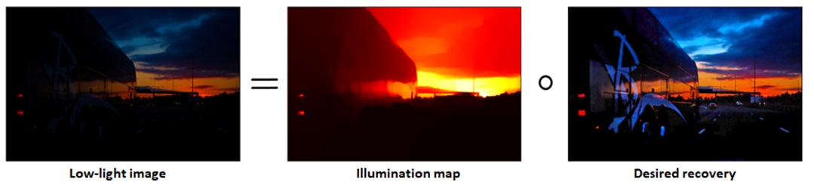
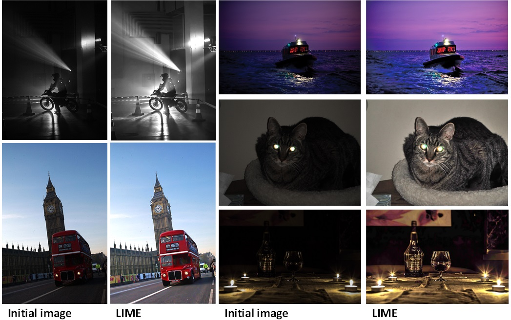
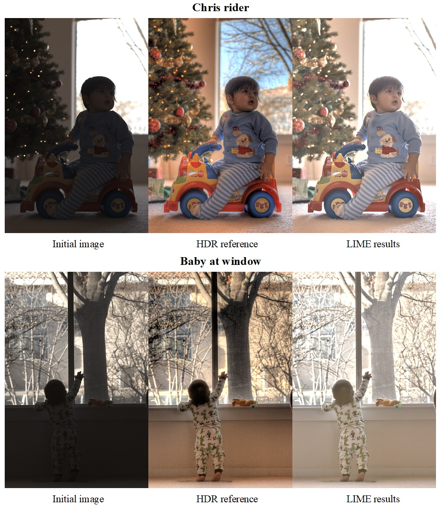

# Python-LIME
Implementation of the sped-up solver of the LIME image enhancement algorithm from the paper "LIME: Low-Light Image Enhancement via Illumination Map Estimation" [1] applied to images from the Exclusively Dark Image Dataset [2] and quantitatively evaluated on the HDR Dataset [3].<br>

# Method Overview
Images captured in low-light conditions typically suffer from reduced visibility, impacting their overall quality and visual appeal. Moreover, such conditions can result in decreased performance for computer vision and multimedia algorithms that heavily rely on high-quality inputs.<br>
The code implements the Low-Light Image Enhancement via illumination map estimation (LIME) method, designed to enhance dark images. This method entails estimating the illumination of each pixel by identifying the maximum value in the red, green, and blue channels. Subsequently, the initial illumination map undergoes further refinement through the resolution of an optimization problem formulated by the authors of the original paper. The enhancement of lighting is achieved by applying the updated illumination map to a low-light input. The underlying concept of the method is based on the idea that every image can be represented by a pixelwise product of an illumination map and an "ideal" image.<br>

<p align='center'>

</p>

When a low-light image is used as input, the method estimates its illumination map and solves the following minimization problem to recover a desired version of the low-light image.<br>

```math
min_T‖\mathbf{T}-\mathbf{\hat{T}}‖_F^2+α‖\mathbf{W}∘\nabla\mathbf{T}‖_1
```

where $\mathbf{T}$ is a true illumination map, $\mathbf{\hat{T}}$ is an initial estimation of an illumination map, α is the global atmospheric light, $\mathbf{W}$ is the weight matrix, $\nabla\mathbf{T}$ is the first order derivative, $‖∙‖_F$ and $‖∙‖_1$ are the Frobenious and L1 norms, the ∘ operator represents pixelwise multiplication.<br>
Making certain assumptions, the authors distill the aforementioned minimization problem into the following equation:<br>

```math
(\mathbf{I}+\alpha\sum_{d\epsilon[h,v]}\mathbf{D^T_d}Diag(\mathbf{\widetilde{w}_d})\mathbf{D^T_d})\mathbf{t}=\mathbf{\hat{t}}
```

where $\mathbf{I}$ is the identity matrix with proper size, $\mathbf{D_v}$ and $\mathbf{D_h}$ are the Toeplitz matrices for the discrete gradient with forward difference in both vertical and horizontal directions, $\mathbf{t}$ and $\mathbf{\hat{t}}$ are the vectorized version of refined and initial illumination maps respectively, $\mathbf{\widetilde{w}_v}$ and $\mathbf{\widetilde{w}_v}$ are the vectorized versions of $\mathbf{\widetilde{W}_v}$ and $\mathbf{\widetilde{W}_h}$, and Diag(x) is an operation of constructing a diagonal matrix with vector x.<br>
Weight matrices are initialized by one of three strategies and then scaled with gradient. Toeplitz matrices look as follows
```math
\mathbf{D}_\mathbf{v}=\left(\begin{matrix}-1&\cdots&0&1&\cdots&0\\\vdots&\ddots&\vdots&\vdots&\ddots&\vdots\\0&\cdots&-1&0&0&1\\1&\cdots&0&-1&0&0\\\vdots&\ddots&\vdots&\vdots&\ddots&\vdots\\0&\cdots&1&0&\cdots&-1\\\end{matrix}\right)
\mathbf{D}_\mathbf{h}=\left(\begin{matrix}-1&1&0&\cdots&0&0\\0&-1&1&\cdots&0&0\\0&0&-1&\cdots&0&0\\\vdots&\vdots&\vdots&\ddots&\vdots&\vdots\\0&0&0&\cdots&-1&1\\0&0&0&\cdots&0&-1\\\end{matrix}\right)
```
The vectorization is implemented by vertical stacking of transposed row vectors, but it could be done by stacking column of vectors one after the other either. Therewith, Toeplitz matrices for the discrete gradient would be different in these two cases. Their appearance is also dependent on which side of the Toeplitz matrix the vectorized term is located. The general structure of these matrices is given above. However, rows of these matrices, corresponding to elements located on the boundaries of an image, could deviate from the general structure. In essence, their form depends on the intended padding. To prevent the introduction of extra gradients on the boundaries of images, the corresponding rows consist of zeros.<br>

# What does the code do?
The code formulates the problem for given images and automatically calculates a refined illumination map, presenting the exact solution of the equation derived by the authors.
```math
\mathbf{t}=(\mathbf{I}+\alpha\sum_{d\epsilon[h,v]}\mathbf{D^T_d}Diag(\mathbf{\widetilde{w}_d})\mathbf{D^T_d})^{-1}\mathbf{\hat{t}}
```
As observed, the LIME method involves operations with matrices of large sizes. Consequently, the sped-up version of the method requires solving a massive system of linear equations. While solving a system of linear equations is a relatively straightforward task, the large dimensions of the matrices necessitate the application of specific techniques for efficient results. If the size of the input image is M by N pixels, the size of the vector would be M∙N by 1. Therefore, the corresponding size of the Toeplitz matrices would be M∙N by M∙N. Fortunately, these large matrices are sparse, and operations with sparse matrices require fewer computational resources with a proper approach. Hence, the code utilizes specific tools from the SciPy library to leverage the sparsity of matrices.

# Results
TThe performance of the LIME method is demonstrated on several images from the ExDark dataset. The algorithm is applied with fixed parameters: $\sigma_w$ = 2, $\sigma_{BM3D}$ = 0.04, $\alpha$ = 0.15 and $\gamma$ = 0.6. $\sigma_{BM3D}$ reffers to the BM3D method [4] applied here for denoising.<br>
<p align='center'>

</p>

For quantitative performance evaluation is a challenging problem the lightness order error (LOE) metric employed by the authors is used.
$$\ \ \ \ \ LOE\ =\frac{1}{m}\ \sum_{x=1}^{m}\sum_{y=1}^{m}\left(U\left(Q\left(x\right),Q\left(y\right)\right)\oplus U\left(Q_r\left(x\right),Q_r\left(y\right)\right)\right),\ \ \ \ \ \ $$
where $U\left(p,q\right)=True\ if\ p\geq\ q$ or $U\left(p,q\right)=False\ if\ p\<\ q$, m is the total number of pixels, Q(x) is the maximal intensity value of a pixel x across all color channels, ⊕ is logical exclusive-or operator.<br>
In my personal opinion, this metric cannot be deemed a perfect solution. The reason is that the LOE value would be equal to zero for simple enhancement techniques like gamma correction or even in the absence of any illumination enhancement. Consequently, qualitatively inferior results could quantitatively outperform better ones. Another drawback of this evaluation method is its reliance on a ground truth reference, which, in the case of illumination enhancement, is a nominal and blurry term. Moreover, computation of this metric is relatively expensive due to its complexity. Therefore, it is recommended to down-sample images before computation, with the suggested value of the down-sample factor being 100/min(h, w), where h and w represent the height and width of the image.<br>
To reproduce the paper results for a fair comparison, this metric is employed. As the ExDark dataset lacks illumination ground truth, the LOE value for images mentioned in the original paper is not available. The authors use the HDR dataset to evaluate their algorithm.


<p align='center'>

</p>

In the following table, LOE values are presented (every value has a factor of $10^3$)
<p align='center'>

| BabyAtWin | BabyOnGrass | ChrisRider | HighChair | LadyEating | SantaHelper |
| :---: | :---: | :---: | :---: | :---: | :---: |
| 1.277 | 1.040 | 0.952 | 2.368 | 2.199 | 2.374|

# Possible improvements
1. To implement an accelerated technique for calculating the exact solution of the equation from the formulation. Although the equation represents a sped-up version of the problem, the straightforward solution of this equation is still relatively slow, even leveraging the sparsity of matrices. Some algorithms could guarantee better rates of computations..<br>
2. To propose another metric for the quantitative evaluation of the method, which would help alleviate the skepticism associated with LOE.<br>

# References
[1]	X. Guo, Y. Li and H. Ling, "LIME: Low-Light Image Enhancement via Illumination Map Estimation," in IEEE Transactions on Image Processing, vol. 26, no. 2, pp. 982-993, Feb. 2017, doi: 10.1109/TIP.2016.2639450.<br>
[2]	Y.P. Loh, C.S. Chan, "Getting to know low-light images with the Exclusively Dark dataset", Computer Vision and Image Understanding, vol. 178, pp. 30-42, 2019, doi: 10.1016/j.cviu.2018.10.010.<br> 
[3]	P. Sen, N. K. Kalantari, M. Yaesoubi, S. Darabi, D. B. Goldman, and E. Shechtman, “Robust patch-based HDR reconstruction of dynamic scenes,” ACM Trans. Graph., vol. 31, no. 6, pp. 203:1–203:11, 2012.<br>
[4] K. Dabov, A. Foi, V. Katkovnik, and K. Egiazarian, “Image denoising by sparse 3D transform-domain collaborative filtering,” IEEE Trans. Image Process., vol. 16, no. 8, pp. 2080–2095, Aug. 2007.
